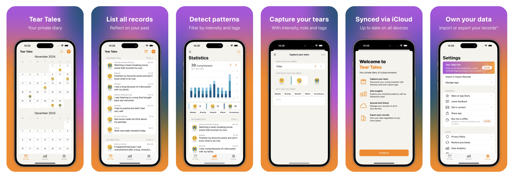

# EasyFrameCommand
`easy-frame` is a lightweight Swift command-line tool to create fully customizable framed App Store screenshots using SwiftUI. Built for automation, this open-source Swift package efficiently frames screenshots for all localizations and devices. While it follows a workflow similar to fastlane’s frameit, you are in full controll. Simply fork the reporsitory with just about 400 lines of swift code and get as creative as you desire.



## Who is this tool for?
This Swift package is ideal for indie Swift developers who value:  
- **Automation** over manual screenshot creation  
- **Full design control** over relying on premade templates with limited customization options
- **A free and open-source solution** over paid alternatives

## Getting started
To generate screenshots like in the example above - using the implementation as-is, just follow the below steps:
1. Set up the directory structure as shown in the example below. Place your unframed raw screenshots in the `raw-screenshots` directory, organized by locale.  
    ```
    parent-folder/
        raw-screenshots/
            EasyFrame.json
            de-DE/
                iPhone 15 Pro Max-1-calendar.png
                iPhone 15 Pro Max-2-list.png
                iPhone 15 Pro Max-3-add-entry.png
                iPad Pro (12.9-inch) (6th generation)-1-calendar.png
                iPad Pro (12.9-inch) (6th generation)-2-list.png
                iPad Pro (12.9-inch) (6th generation)-3-add-entry.png
            en-GB/
                iPhone 15 Pro Max-1-calendar.png
                iPhone 15 Pro Max-2-list.png
                iPhone 15 Pro Max-3-add-entry.png
                iPad Pro (12.9-inch) (6th generation)-1-calendar.png
                iPad Pro (12.9-inch) (6th generation)-2-list.png
                iPad Pro (12.9-inch) (6th generation)-3-add-entry.png
    ```
   - If you use Fastlane to generate unframed screenshots, its output directory structure already meets `easy-frame`'s requirements. Just ensure that the `output_directory` is set to `raw-screenshots`.  
        ```ruby
        capture_ios_screenshots(
            devices: ["iPhone 15 Pro Max", "iPad Pro (12.9-inch) (6th generation)"],
            languages: ["de-DE", "en-GB"],
            scheme: ENV["XCODE_SCHEME_UI_TEST"],
            output_directory: "./fastlane/raw-screenshots"
        )
        ```
1. Create an `EasyFrame.json` configuration file based on the below [Example EasyFrame.json](#example-easyframejson). The config defines each App Store page with:  
    - localized texts, which will be displayed on the framed screenshot  
    - a screenshot name, which must partially match the raw screenshot filenames
1. Run the local `easy-frame` swift package command to generate framed screenshots into the `parent-folder/screenshots/` directory:
    ```sh
    cd path/to/EasyFrameCommandProject
    swift run easy-frame path/to/parent-folder
    ```

## Which devices are supported?
All five platforms an App Store listing can need. See [Sources/EasyFrameCommand/Model/SupportedDevice.swift](Sources/EasyFrameCommand/Model/SupportedDevice.swift) for the declarations.

| Layout | Frame art | Store slot | Notes |
| --- | --- | --- | --- |
| `iPhone17ProMax` | Apple | 1320 x 2868 | Silver, portrait |
| `iPadPro13M5` | Apple | 2064 x 2752 | Space Black, portrait |
| `macBookPro14` | Apple | 2880 x 1800 | Captures a 3024 x 1964 window, see below |
| `appleTV4K` | Apple | 3840 x 2160 | Cut-out is **not** centred in the art |
| `visionPro` | *none* | 3840 x 2160 | Deliberately frameless, see below |
| `iPhone14ProMax` | frameit-frames | 1290 x 2796 | Also serves 15/16/17 Pro Max, downscaled |
| `iPadPro` | frameit-frames | 2048 x 2732 | Also serves the 13-inch iPad Pro, downscaled |
| `iPhoneSE3rdGen` | frameit-frames | 750 x 1334 | |

Two of those rows need a sentence:

- **Vision Pro is frameless on purpose.** Apple publishes no Vision Pro product bezel, and that is not
  a gap to work around: a visionOS listing conventionally shows the capture itself, because the
  platform's content floats in a room rather than sitting in a device. A layout with
  `deviceImageName: nil` renders its capture as a rounded, shadowed card under a taller caption band.
- **The Mac's page is not its capture's size.** A desktop capture is a *window*, and the window that
  fills the MacBook cut-out exactly is 3024 x 1964 — which is not one of the four sizes App Store
  Connect accepts for a Mac page. So `deviceScreenSize` is the 2880 x 1800 slot the page is rendered
  at, and the capture's own size rides in `additionalScreenSizes`.

The frames marked **Apple** are four PNGs published by Apple, committed to `Sources/Resources/` and
refreshed by `scripts/fetch-device-bezels.sh`. **They arrive under two different Apple licences and
[BEZELS.md](BEZELS.md) is required reading before you use, move or add to them** — in short, the
artwork is licensed for mock-ups of Apple-platform software, may not be embedded in a software
program, and anyone you hand work made with it has to be made aware of the restrictions. This
repository's MIT licence does not extend to those files.

The rest are from https://github.com/fastlane/frameit-frames.

## How does a screenshot find its frame?
By pixel size, and then — if you ask for it — by name.

`getFirstMatchingLayout(byPixelSize:)` is the original rule and still the fallback: a capture matches
the layout whose `deviceScreenSize` or `additionalScreenSizes` contains its pixel size. That is enough
for most devices and needs no configuration at all.

It is not enough for every device. **Apple TV and Vision Pro both capture at exactly 3840 x 2160**,
and they want opposite treatments — a television bezel against no bezel at all. So a layout can also
declare `deviceNameMatches`, which is tried first:

```swift
static let appleTV4K = Self(
    deviceImageName: "Apple TV - 4K.png",
    deviceScreenSize: .appleTVStore,
    deviceNameMatches: ["appletv", "apple tv", "apple tv 4k"],
    ...
)
```

Those aliases are compared **case-insensitively for equality** against the capture file name's
*device segment* — everything before its first `-`. So `AppleTV-1-home.png` matches and
`Apple TV 4K (3rd generation)-1-home.png` matches too, because that exact string is in the list.

The equality is deliberate, and it is what keeps this backwards-compatible. A `fastlane snapshot`
file is named `iPhone 14 Pro Max-1-home.png`; had the aliases been matched as *substrings*, any
layout claiming `"iphone"` would have quietly taken over every existing iPhone screenshot in every
existing project. Under equality such a name matches nothing, falls through to the size lookup, and
resolves exactly as it always did. **Name matching is opt-in**: name a capture's device segment for
the layout you want, or say nothing and keep the behaviour you have.

To add a device of your own, give its layout the names you actually write. If your capture script
produces `Watch-1-home.png`, `deviceNameMatches: ["watch"]` is the whole of it.

## Where to adjust the SwiftUI layout?
See [Sources/EasyFrameCommand/View/ScreenshotDesignView.swift](Sources/EasyFrameCommand/View/ScreenshotDesignView.swift)
    
## Example directory structure
```
parent-folder/
    raw-screenshots/ (the locale folders contains the unframed raw screenshots)
        EasyFrame.json
        de-DE/
            iPhone 15 Pro Max-1-calendar.png
            iPhone 15 Pro Max-2-list.png
            iPhone 15 Pro Max-3-add-entry.png
            iPad Pro (12.9-inch) (6th generation)-1-calendar.png
            iPad Pro (12.9-inch) (6th generation)-2-list.png
            iPad Pro (12.9-inch) (6th generation)-3-add-entry.png
        en-GB/
            iPhone 15 Pro Max-1-calendar.png
            iPhone 15 Pro Max-2-list.png
            iPhone 15 Pro Max-3-add-entry.png
            iPad Pro (12.9-inch) (6th generation)-1-calendar.png
            iPad Pro (12.9-inch) (6th generation)-2-list.png
            iPad Pro (12.9-inch) (6th generation)-3-add-entry.png
    screenshots/ (this folder will be generated by easy-frame with the framed screenshots)
        de-DE/
            iPhone 15 Pro Max-1-calendar.jpg
            iPhone 15 Pro Max-2-list.jpg
            iPhone 15 Pro Max-3-add-entry.jpg
            iPad Pro (12.9-inch) (6th generation)-1-calendar.jpg
            iPad Pro (12.9-inch) (6th generation)-2-list.jpg
            iPad Pro (12.9-inch) (6th generation)-3-add-entry.jpg
        en-GB/
            iPhone 15 Pro Max-1-calendar.jpg
            iPhone 15 Pro Max-2-list.jpg
            iPhone 15 Pro Max-3-add-entry.jpg
            iPad Pro (12.9-inch) (6th generation)-1-calendar.jpg
            iPad Pro (12.9-inch) (6th generation)-2-list.jpg
            iPad Pro (12.9-inch) (6th generation)-3-add-entry.jpg
```

## Example EasyFrame.json
```json
{
    "pages": [
        {
            "languages": [
                { "locale": "en-GB", "title": "Title 1 EN", "description": "Description" },
                { "locale": "de-DE", "title": "Title 1 DE", "description": "Description" }
            ],
            "screenshot": "1-calendar"
        },
        {
            "languages": [
                { "locale": "en-GB", "title": "Title 2 EN", "description": "Description" },
                { "locale": "de-DE", "title": "Title 2 DE", "description": "Description" }
            ],
            "screenshot": "2-list"
        },
        {
            "languages": [
                { "locale": "en-GB", "title": "Title 3 EN", "description": "Description" },
                { "locale": "de-DE", "title": "Title 3 DE", "description": "Description" }
            ],
            "screenshot": "3-add-entry"
        }
    ]
}
```

## Acknowledgments
Thanks to [FrameKit](https://github.com/ainame/FrameKit) and fastlane [frameit](https://docs.fastlane.tools/actions/frameit/), which both inspired me and made this swift package possible.

## Roadmap
There is no planned roadmap or a guarantee of ongoing maintenance. This Swift package is intended to be forked and serves as a solid starting point for further customization 😉
